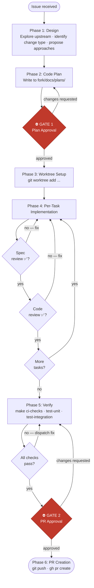
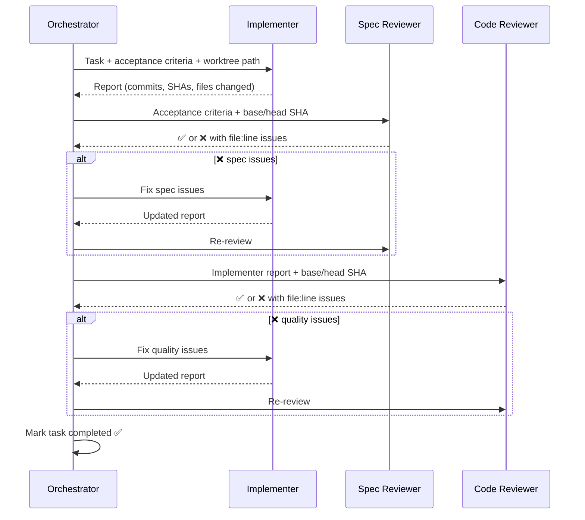

# etcd-druid-skills

> A Claude Code plugin that encodes expert knowledge for [etcd-druid](https://github.com/gardener/etcd-druid) contributors — injects domain awareness, workflow discipline, and review rigor into every AI-assisted session.

[](LICENSE)
[](https://github.com/anthropics/claude-code)
[](https://github.com/anthropics/claude-code-superpowers)

---

## Table of Contents

- [Overview](#overview)
- [The Three-Component System](#the-three-component-system)
- [Skills](#skills)
- [Feature Development Workflow](#feature-development-workflow-feature-dev)
  - [Workflow Diagram](#workflow-diagram)
  - [Per-Task Review Loop](#per-task-review-loop)
  - [Commit Conventions](#commit-conventions)
- [Key Invariants](#key-invariants)
- [Installation](#installation)
- [Contributing](#contributing)

---

## Overview

Without this plugin, Claude starts each session knowing Go and Kubernetes but nothing about etcd-druid's operator interface, testing conventions, API generation process, or review requirements. You spend the first part of every session re-explaining context.

With this plugin, Claude starts already oriented:

| Without plugin | With plugin |
|---|---|
| "What's the Operator interface?" | Knows `PreSync`, `Sync`, `TriggerDelete`, `GetExistingResourceNames` |
| May use Ginkgo in etcd-druid | Knows to use Go native + Gomega only |
| May edit generated files | Knows generated files are off-limits |
| No review discipline | Runs spec-review and code-review after every task |
| Skips `make generate` | Enforces two-commit rule for API changes |

**The plugin is a workflow orchestrator, not a code library.** It never embeds code patterns inline — those live in each repo's `docs/development/`. The plugin tells Claude where to look and enforces the process.

Inspired by the [Superpowers](https://github.com/anthropics/claude-code-superpowers) plugin system for Claude Code.

---

## The Three-Component System

```
┌─────────────────────────────────────────────────────────────┐
│                     Gardener Seed Cluster                    │
│                                                             │
│  ┌─────────────────┐                                        │
│  │   etcd-druid    │  Kubernetes operator                   │
│  │   (operator)    │  Owns Etcd CRD, reconciles resources   │
│  └────────┬────────┘                                        │
│           │ manages                                          │
│           ▼                                                  │
│  ┌─────────────────────────────────────────────┐            │
│  │              etcd StatefulSet               │            │
│  │                                             │            │
│  │  ┌──────────────┐    ┌──────────────────┐  │            │
│  │  │ etcd-wrapper │───▶│ etcd-backup-     │  │            │
│  │  │  (sidecar)   │    │ restore (sidecar)│  │            │
│  │  └──────────────┘    └──────────────────┘  │            │
│  │        │                     │              │            │
│  │   starts etcd          snapshot/restore     │            │
│  └─────────────────────────────────────────────┘            │
└─────────────────────────────────────────────────────────────┘
```

| Repo | Role | Test Framework |
|------|------|---------------|
| [etcd-druid](https://github.com/gardener/etcd-druid) | Kubernetes operator | Go native `testing.T` + Gomega |
| [etcd-backup-restore](https://github.com/gardener/etcd-backup-restore) | Snapshot, restore, init sidecar | Ginkgo v2 + Gomega |
| [etcd-wrapper](https://github.com/gardener/etcd-wrapper) | etcd starter sidecar | Go native `testing.T` + Gomega |

---

## Skills

| Skill | Invoke | Activates on | Use when |
|-------|--------|-------------|----------|
| `feature-dev` | `/etcd-druid:feature-dev` | explicit | Picking up an issue, planning and implementing a feature or bug fix, design-to-PR |
| `tdd` | `/etcd-druid:tdd` | `*.go` files | Writing new tests or learning the correct test pattern for any of the three repos |
| `debug` | `/etcd-druid:debug` | `*.go` files | Something is failing, broken, or behaving unexpectedly |
| `review` | `/etcd-druid:review` | `*.go` files | Validating code before opening a PR — self-review or reviewing a colleague's PR |
| `reference` | `/etcd-druid:reference` | explicit | Quick lookup: make targets, file paths, EtcdOpsTask, druidctl, git workflow |

The `tdd`, `debug`, and `review` skills activate automatically when Claude edits `.go` files (`paths: **/*.go` frontmatter), in addition to explicit invocation.

---

## Feature Development Workflow (`feature-dev`)

The `feature-dev` skill runs a structured design-to-PR workflow with **two hard human approval gates** — no code before Gate 1, no push before Gate 2.

### Workflow Diagram



### Per-Task Review Loop

Each task goes through two independent subagent reviews before it is marked complete:



**Spec reviewer** checks: acceptance criteria satisfied, no unplanned files changed, two-commit rule for API generation.

**Code reviewer** checks: docs/development/ conventions, Operator interface completeness, error handling, API change requirements, test framework correctness, commit message format, and known footguns (removed feature gates, removed flags).

### Commit Conventions

```
Add snapshot lease rotation to memberlease component (#1350)   ✅
Fixed the bug.                                                  ❌  (past tense, trailing period)
add configmap ttl                                               ❌  (no issue number, lowercase)
```

**API changes use two commits:**

```
Commit 1: Add ExpirySeconds field to EtcdSpec  (#1350)
          └── hand-written changes only: api/core/v1alpha1/*.go

Commit 2: Run make generate for ExpirySeconds field (#1350)
          └── generated output only: zz_generated.deepcopy.go, crds/*.yaml, charts/crds/*.yaml
```

---

## Key Invariants

### Operator Interface (etcd-druid)

Every component in `internal/component/<name>/` must implement all four methods:

```
PreSync(ctx, client, etcd)              → ReconcileStepResult
Sync(ctx, client, etcd)                 → error
TriggerDelete(ctx, client, etcd)        → error
GetExistingResourceNames(ctx, client, etcd) → ([]string, error)
```

Register via `registry.Register(component.Kind, operator)` in `internal/controller/etcd/reconciler.go`.

### Generated Files — Never Edit Manually

```
api/core/v1alpha1/zz_generated.deepcopy.go    ← generated
api/core/v1alpha1/crds/*.yaml                 ← generated
charts/crds/*.yaml                            ← generated
client/                                       ← generated

To regenerate: cd api && make generate
To verify:     cd api && make check-generate
```

### Test Framework by Repo

| Repo | Framework | What NOT to use |
|------|-----------|-----------------|
| etcd-druid | Go native `testing.T` + Gomega | Ginkgo, gomock |
| etcd-wrapper | Go native `testing.T` + Gomega | Ginkgo, gomock |
| etcd-backup-restore | Ginkgo v2 + Gomega | — |

Universal: no `time.Sleep()` — use `Eventually` / `Consistently` for async assertions.

### Known Footguns

| Item | Status | Action |
|------|--------|--------|
| `UseEtcdWrapper` feature gate | **Removed** | Delete any reference |
| `--enable-etcd-member-gc` flag | **Removed** (v0.42) | Delete any reference |
| `UpgradeEtcdVersion` feature gate | Alpha (v0.36+) | Must be gated behind `featureGates.Enabled()` |

### Hard Rules

- NEVER commit to upstream (`github.com/gardener/*`)
- NEVER push or create a PR without explicit human approval
- NEVER edit generated files manually
- Conventions live in `docs/development/` in each repo — read them, update them when you find gaps

---

## Installation

```bash
claude /install-plugin https://github.com/seshachalam-yv/etcd-druid-skills
/reload-plugins
```

### What gets injected

Every session start, Claude receives:
- Orientation on the three-component system and key invariants
- Detected active repo (etcd-druid / etcd-backup-restore / etcd-wrapper) with path to its `docs/development/`
- Key docs to read in that repo
- Current branch and recent commits

---

## Contributing

Found a gap, wrong pattern, or missing best practice?

**For code patterns and conventions:** contribute to the relevant repo's `docs/development/` — that's where they belong.

**For skill workflow issues:** open a PR against this repo and edit `skills/<name>/SKILL.md`.

When the code-reviewer skill finds a plugin mistake, it outputs a ready-to-use `gh pr create` command targeting this repo so the fix is one copy-paste away.

---

## License

Apache-2.0
