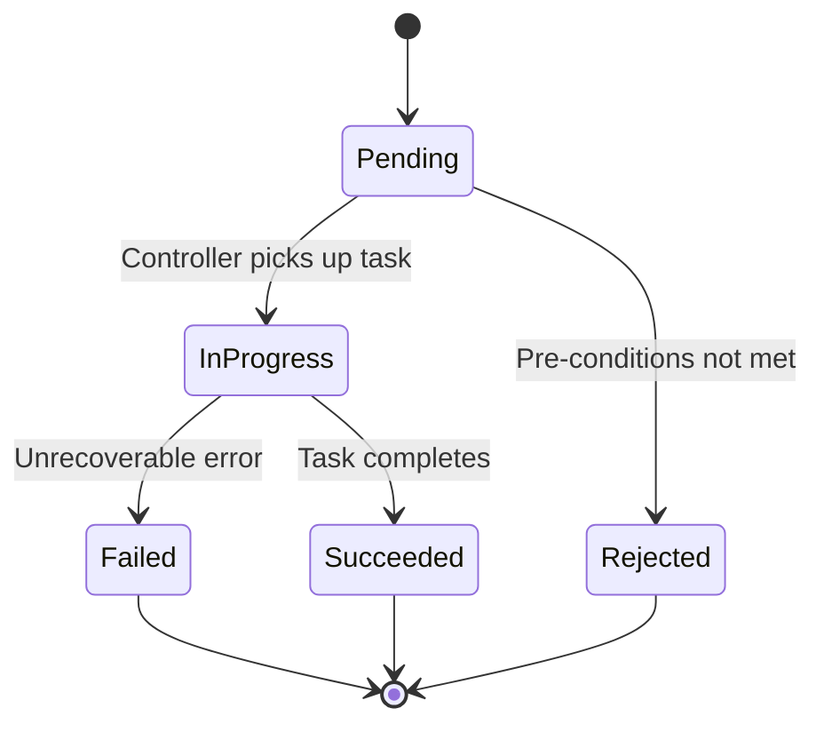
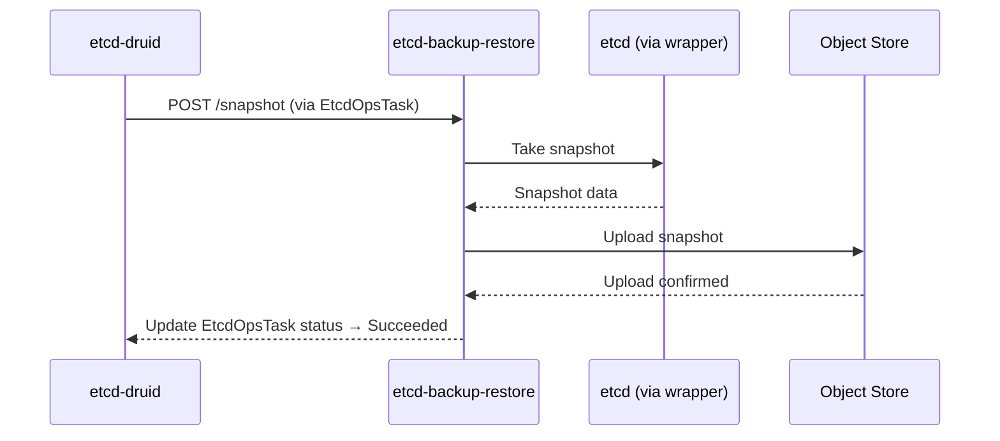
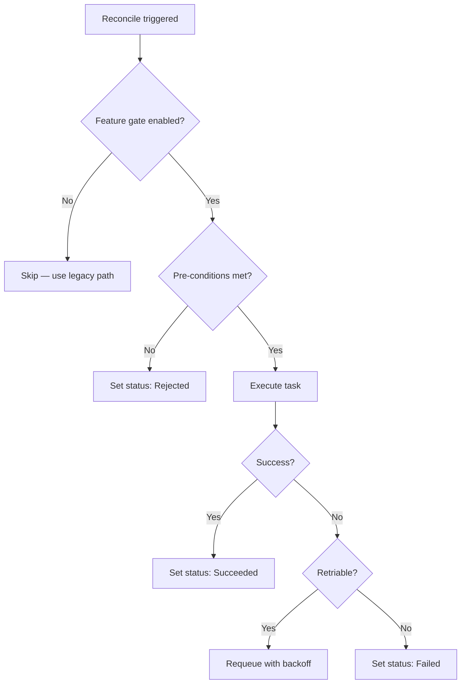
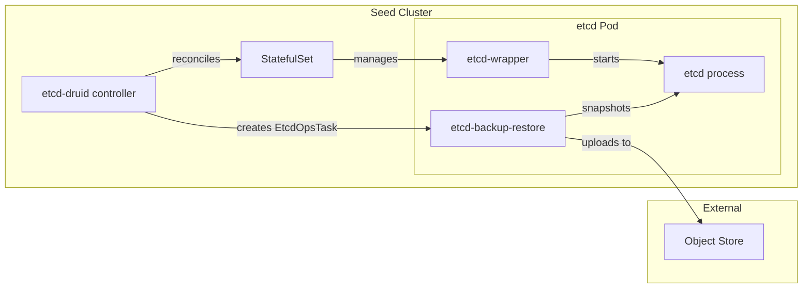
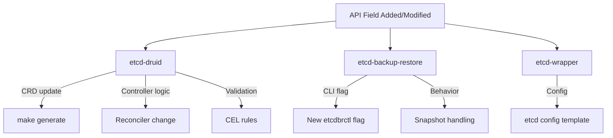
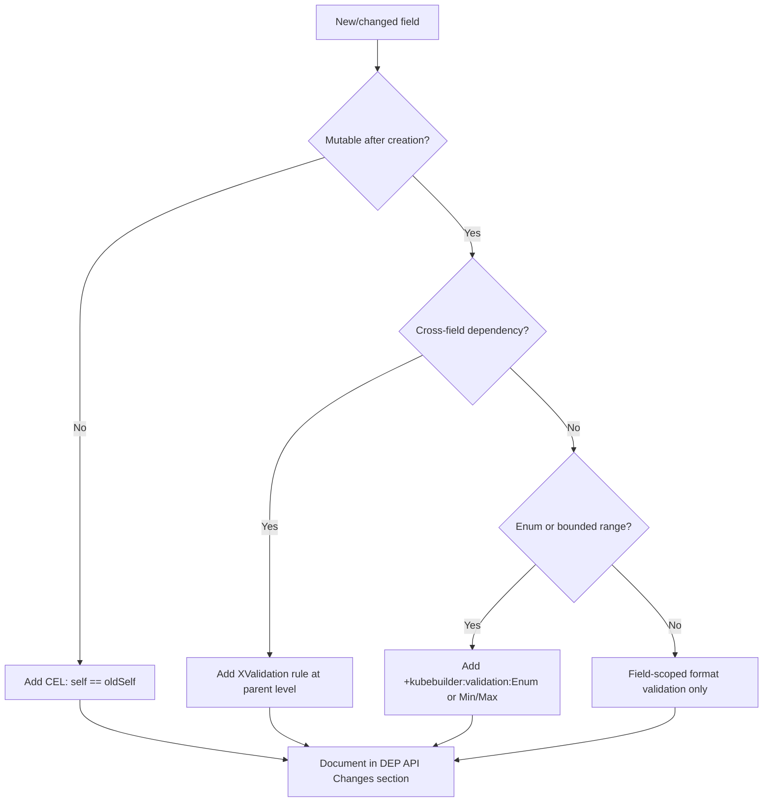

# Diagram Guide for DEPs

Every DEP MUST include at least one Mermaid diagram. Use the table below to choose the right type based on your proposal content.

> **Anti-pattern: redundant diagrams.** A diagram earns its place by making
> branching, ordering, or state visible at a glance. If your diagram only
> restates two or three sentences of surrounding prose, remove it — reviewers
> will ask "do we need this?" and they will be right. Diagrams should add
> structure that the text alone cannot convey.

## When to Use Which Diagram

| Proposal content | Diagram type | Mermaid syntax |
|-----------------|--------------|----------------|
| Component has discrete lifecycle phases | State diagram | `stateDiagram-v2` |
| Multi-step orchestration across components | Flowchart | `flowchart TD` |
| Request/response between 2-3 actors | Sequence diagram | `sequenceDiagram` |
| New component in existing ecosystem | Architecture diagram | `flowchart LR` with subgraphs |
| Decision logic with branches | Flowchart with decisions | `flowchart TD` with `{}` diamond nodes |
| Failure recovery paths | Flowchart | `flowchart TD` |

## Rules

1. At least one diagram per DEP (hard requirement)
2. State diagrams for any proposal with lifecycle phases
3. Sequence diagrams for cross-component interaction with specific message ordering
4. Use Mermaid syntax (renders in GitHub markdown)
5. Diagrams inline in proposal body (unless >30 lines, then separate file in `assets/`)
6. Label all transitions with the triggering event or condition
7. Include error/failure transitions, not just happy path

## Quality Checklist

Before committing a diagram, walk this list. These are the recurring nits
reviewers raise on DEP diagrams:

- [ ] **Every decision arrow has a label.** A diamond with one labelled arrow
      and one unlabelled arrow is the #1 reviewer complaint. Both `Yes`/`No`
      branches (or every named condition) must be on the arrow, not implied.
- [ ] **Every node names the entity it refers to.** "Is etcd process dead?"
      is ambiguous — which pod? Prefer "Is etcd process dead in selected
      pod?" or scope the question with prior context in the diagram.
- [ ] **Failure paths are present.** Not just the happy path — show what
      happens when a step fails, retries, or escalates.
- [ ] **The diagram earns its place.** If it only restates the surrounding
      prose without adding branching, ordering, or state structure, remove
      it (see anti-pattern at the top of this file).
- [ ] **Source file is committed alongside the rendered image.** If you use
      Excalidraw / draw.io / external tooling to produce a `.png` in
      `docs/proposals/assets/`, also commit the source file (`.excalidraw`,
      `.drawio`, or the Mermaid block) so future authors can edit it.
- [ ] **Inline Mermaid for diagrams that fit.** Prefer inline Mermaid blocks
      over external `.png` files when the diagram is under ~30 lines —
      Mermaid renders in GitHub and stays diff-friendly.

## Patterns by Scenario

### Lifecycle / State Machine

Use when: EtcdMember states, EtcdOpsTask states, migration phases, feature gate transitions.

### Cross-Component Interaction

Use when: druid ↔ backup-restore communication, scale-up handshake, snapshot trigger flow.

### Reconciliation / Decision Flow

Use when: Controller reconciliation logic, pre-condition evaluation, feature gate behavior.

### Architecture / Component Relationships

Use when: Introducing new sidecar, new controller, or showing how components interact in a cluster.

### Breaking Change Impact

Use when: Showing which components are affected by an API or behavioral change.

### CEL Validation Decision Tree

Use when: Deciding what type of CEL validation to apply to new/changed fields.

