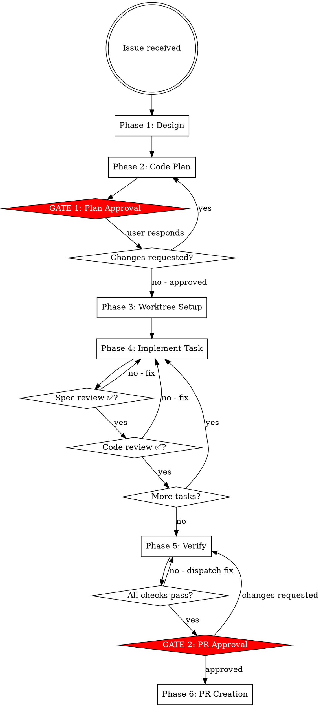

# etcd-druid Feature Development

Full workflow from issue to merged PR. Two hard gates: plan approval before code, PR approval before push.

## Workflow Overview



## Hard Rules

- NEVER write code before Gate 1 (plan approval)
- NEVER push or create a PR before Gate 2 (PR approval)
- NEVER skip spec-review or code-review after each task
- NEVER commit to upstream (github.com/gardener/etcd-druid)
- ALL implementation work happens inside the git worktree

---

## Phase 1: Design

1. Create tasks for all workflow phases with TaskCreate
2. Explore upstream (read-only) to understand current state:
   - Which controller, component, or API is affected?
   - Change type: API (`api/core/v1alpha1/`) | component (`internal/component/`) | controller (`internal/controller/`) | test only
   - Test scope required: unit (`make test-unit`) | integration (`make test-integration`) | both
3. Ask clarifying questions one at a time — domain-focused
4. Propose 2–3 approaches with trade-offs
5. Confirm approach before writing plan

**Change type guide:**

| Change | Key files | Generation needed |
|--------|-----------|-------------------|
| New API field | `api/core/v1alpha1/*.go` | Yes — `cd api && make generate` |
| New component | `internal/component/<name>/` | No |
| Controller logic | `internal/controller/<name>/` | No |
| Test only | `internal/component/<name>/*_test.go` or `test/it/` | No |

---

## Phase 2: Code Plan

Write plan to fork (worktree does not exist yet):

```bash
mkdir -p <fork-root>/docs/plans
```

Path: `<fork-root>/docs/plans/YYYY-MM-DD-issue-{id}-{short-description}.md`

**Plan format:**

```markdown
## Issue
Link: https://github.com/gardener/etcd-druid/issues/{id}
Summary: one sentence.

## Change Type
[ ] API change (api/core/v1alpha1/)
[ ] New component (internal/component/)
[ ] Controller change (internal/controller/)
[ ] Test only

## Design Summary
Chosen approach and why. Alternatives considered.

## Tasks
- [ ] Task 1: <name>
      Acceptance criteria: <what done looks like>
      Files: <list>
      Tests: unit | integration | both
      API generation: yes | no

- [ ] Task 2: ...

## PR Checklist (pre-submission)
- [ ] make ci-checks passes
- [ ] make test-unit passes
- [ ] make test-integration passes (if integration touched)
- [ ] Documentation updated in docs/ (if user-facing change)
- [ ] examples/ updated (if API changed)

## Rollback
How to revert if needed.
```

---

## ⛔ GATE 1: Plan Approval

STOP. No code. No worktree.

Present:
- Task list with acceptance criteria and files
- Which tasks need `cd api && make generate`
- Testing scope per task
- Plan file path

Say: **"Code plan written to `docs/plans/<filename>`. Reply 'approved' to proceed, or tell me what to change."**

Wait for explicit approval. Changes requested → update plan → present again.

---

## Phase 3: Worktree Setup

After Gate 1 approval:

```bash
cd <fork-root>
git fetch upstream
git worktree add ../etcd-druid-ai-TASK-{id} \
  -b ai/TASK-{id}/claude/{short-description} upstream/master
```

Worktree path: `<fork-root>/../etcd-druid-ai-TASK-{id}`
Branch: `ai/TASK-{id}/claude/{short-description}`

Pass worktree path to all subagents.

---

## Phase 4: Per-Task Implementation

**Model selection:**

| Task type | Model |
|-----------|-------|
| Test-only change, single file | haiku |
| New component method, 2–3 files | sonnet |
| API change, new component, multi-file, debugging | opus |

Repeat for each task:

**a.** Mark task `in_progress` (TaskUpdate)

**b.** Dispatch implementer subagent — see `./implementer-prompt.md`.
   Pass: full task text, worktree path, issue number, files affected, whether API generation is needed.

**c.** Show implementer report to user.

**d.** Dispatch spec-reviewer — see `./spec-reviewer-prompt.md`.
   Pass: acceptance criteria, base SHA, head SHA, worktree path.

**e.** Spec issues → implementer fixes → spec-reviewer re-reviews → repeat until ✅

**f.** Dispatch code-reviewer — see `./code-reviewer-prompt.md`.
   Pass: implementer report, base SHA, head SHA, worktree path.
   Only after spec-reviewer ✅.

**g.** Quality issues → implementer fixes → code-reviewer re-reviews → repeat until ✅

**h.** Mark task `completed` (TaskUpdate). Check off plan checkbox.

**i.** Next task.

---

## Phase 5: Verify

Run in worktree:

```bash
cd <worktree-path>
make ci-checks          # format + lint (runs on main module)
make test-unit          # unit tests (Go native + Ginkgo suites)
make test-integration   # integration tests with envtest (if integration work done)
```

For API changes, also verify generation is clean:
```bash
cd <worktree-path>/api
make check-generate     # confirms make generate produces no uncommitted diff
```

All must pass. Any failure → dispatch fix subagent with full failure output.
Do not proceed to Gate 2 until clean.

---

## ⛔ GATE 2: PR Approval

STOP. No push. No `gh pr create`.

Present:
- PR title (imperative, sentence case, no trailing period)
- PR body draft (see format below)
- `git diff --stat upstream/master...HEAD`
- Full commit list

**PR body format** (matches `.github/pull_request_template.md`):

```
/area <area>        ← audit-logging|auto-scaling|backup|control-plane|disaster-recovery|etcd-config|monitoring|observability|operations|security|testing

/kind <kind>        ← api-change|bug|cleanup|enhancement|feature|flake|task|test

**What this PR does / why we need it:**
<description>

**Fixes:** #<issue-number>

**Special notes for reviewer:**
<any reviewer context>

**Release note:**
<category> <target_group>   ← e.g. "feature user" or "bugfix operator"
```

Say: **"Ready to create PR. Choose one:
  A) Create PR — I push and open it now
  B) Push branch only — I push; you write the PR description
  C) Make changes — tell me what to fix
  D) Discard — I will confirm before deleting"**

Handle:
- **A** → Phase 6
- **B** → `git push origin <branch>`; print compare URL; stop
- **C** → fix → re-verify → Gate 2 again
- **D** → confirm "Are you sure? This deletes the worktree and branch." → on second confirmation: `git worktree remove` + `git branch -d`

---

## Phase 6: PR Creation

```bash
cd <worktree-path>
git push origin ai/TASK-{id}/claude/{short-description}
gh pr create \
  --base master \
  --title "<approved title>" \
  --body "<approved body>"
```

Show the PR URL.

---

## Subagent Status Handling

| Status | Action |
|--------|--------|
| DONE | Proceed to spec review |
| DONE_WITH_CONCERNS | Read concerns. Correctness/scope issue → fix first. Observation only → note and proceed |
| NEEDS_CONTEXT | Provide missing context and re-dispatch implementer |
| BLOCKED | More context → re-dispatch with stronger model → break task smaller → escalate to human |
