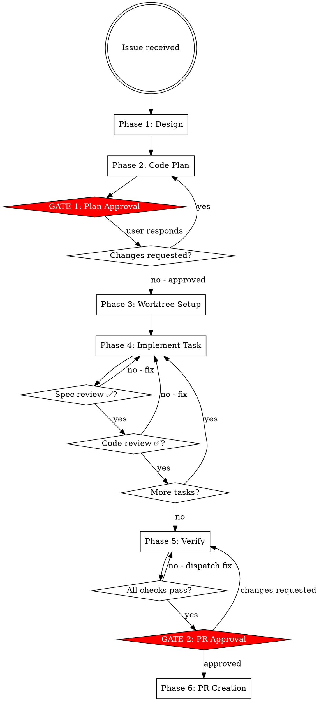

# etcd-druid Feature Development

Full workflow from issue to merged PR. Two hard gates: plan approval before code, PR approval before push.

## Work type — classify first

Before any other step, classify what you're building:

| Type | Examples | How the workflow adapts |
|------|----------|------------------------|
| **Incremental** | Add API field, fix controller bug, new component method | Full workflow as written. "Look at merged PRs" applies. Spec-reviewer covers the whole task. |
| **New sidecar / new binary** | etcd-steward, etcd-wrapper rewrite | Phases are larger. Break tasks at package boundary (one task = one `pkg/<name>`). "Look at merged PRs" step is skipped — no prior art exists. Spec-reviewer scope is per-package, not per-PR. Two-commit API rule only applies to tasks that touch `api/core/v1alpha1/`. |

When in doubt: if the task touches >5 packages or creates a new binary, it's a new sidecar.

## ⛔ Iron Law

**NO CODE BEFORE GATE 1. NO PUSH BEFORE GATE 2.**

| Rationalization | Why it fails |
|---|---|
| "The task is tiny, a plan is overkill" | Small tasks skip assumptions that compound fastest |
| "I already know what to write" | Gate 1 is for the human to catch wrong assumptions before code exists |
| "The plan is in my head, that's enough" | Plans not written are not reviewable and lost after compaction |
| "Just a quick prototype to show direction" | Prototypes become the implementation. Gate 1 exists for this. |

## Workflow Overview



---

## Phase 1: Design

1. Create tasks for all workflow phases with TaskCreate
2. Explore upstream (read-only) to understand current state:
   - Which controller, component, or API is affected?
   - Change type: API (`api/core/v1alpha1/`) | component (`internal/component/`) | controller (`internal/controller/`) | test only
   - Test scope required: unit (`make test-unit`) | integration (`make test-integration`) | both
   - **Look at previously merged PRs** *(incremental work only — skip for new sidecars)*
     (`gh pr list --state merged --repo gardener/etcd-druid`). Find 1–2 comparable PRs and read their diffs to understand how the team structures commits, names things, and what reviewers flag. This shapes your plan before the human sees it.
3. Ask clarifying questions one at a time — domain-focused
4. Propose 2–3 approaches with trade-offs
5. Confirm approach before writing plan

**Change type guide:**

| Change | Key files | Generation needed |
|--------|-----------|-------------------|
| New API field | `api/core/v1alpha1/*.go` | Yes — `cd api && make generate` |
| New component | `internal/component/<name>/` | No |
| Controller logic | `internal/controller/<name>/` | No |
| Test only | `internal/component/<name>/*_test.go` or `test/it/` | No |

**API change note:** For any API change, invoke `/etcd-druid:api-change` — it covers field design, field-scoped vs cross-field CEL validation, two-commit generate workflow, CRD test requirements, and `/kind api-change` PR label. Cross-field CEL rules (those referencing `self.metadata` or fields across two sub-structs) must go on the root `Etcd` type, not on the sub-struct.

---

## Phase 2: Code Plan

Write plan to fork (worktree does not exist yet):

```bash
mkdir -p <fork-root>/docs/plans
```

Path: `<fork-root>/docs/plans/YYYY-MM-DD-issue-{id}-{short-description}.md`

**Plan format:**

```markdown
> **For agentic workers:** Gate 1 is pre-approved for etcd-steward work.
> For etcd-druid work, present this plan and wait for human approval before starting.
> Use feature-dev Phase 4 (per-task subagent loop) to execute tasks.

## Issue
Link: https://github.com/gardener/etcd-druid/issues/{id}
Summary: one sentence.

## Change Type
[ ] API change (api/core/v1alpha1/)
[ ] New component (internal/component/)
[ ] Controller change (internal/controller/)
[ ] Test only

## Design Summary
Chosen approach and why. Alternatives considered.

## Tasks
- [ ] Task 1: <name>
      Acceptance criteria: <see format below>
      Files: <list>
      Tests: unit | integration | both
      API generation: yes | no

- [ ] Task 2: ...

### Acceptance criteria format

Each criterion must be falsifiable by reading code or running a test — not by trusting the implementer's description.

| ❌ Vague — spec-reviewer cannot check | ✅ Falsifiable — spec-reviewer reads code or runs test |
|---------------------------------------|-------------------------------------------------------|
| "state transitions are persisted" | `after Init() returns, member.Transitions[0].State == StateNew` (verified by `TestInitializer_NewSingleNode`) |
| "covers all 4 initialization paths" | `TestInitializer_PathA`, `_PathB`, `_PathC`, `_PathD` all exist and pass |
| "LastRestoration is updated" | `EtcdMember.Status.LastRestoration.Status == RestorationSucceeded` after `TestRestoreFromSnapshot` |

For state machine work: write the exact transition sequence for each path as a table, then name the test that verifies it. The test name IS the acceptance criterion.

## PR Checklist (pre-submission)
- [ ] make ci-checks passes
- [ ] make test-unit passes
- [ ] make test-integration passes (if integration touched)
- [ ] E2e verification: <test name or "not required — test-only change">
- [ ] Documentation updated in docs/ (if user-facing change)
- [ ] examples/ updated (if API changed)

## Rollback
How to revert if needed.
```

---

## ⛔ GATE 1: Plan Approval

STOP. No code. No worktree.

Present:
- Task list with acceptance criteria and files
- Which tasks need `cd api && make generate`
- Testing scope per task
- Plan file path

Say: **"Code plan written to `docs/plans/<filename>`. Reply 'approved' to proceed, or tell me what to change."**

Wait for explicit approval. Changes requested → update plan → present again.

---

## Phase 3: Worktree Setup

After Gate 1 approval:

```bash
cd <fork-root>
git fetch upstream

# Safety: ensure worktree directory is gitignored before creating it
git check-ignore -q .worktrees || {
  echo '.worktrees/' >> .gitignore
  git add .gitignore
  git commit -m "Add .worktrees/ to .gitignore"
}

git worktree add .worktrees/etcd-druid-ai-TASK-{id} \
  -b ai/TASK-{id}/claude/{short-description} upstream/master
```

Worktree path: `<fork-root>/.worktrees/etcd-druid-ai-TASK-{id}`
Branch: `ai/TASK-{id}/claude/{short-description}`

After creating the worktree, run setup and verify a clean baseline:

```bash
cd <worktree-path>
go mod download

# Verify baseline is clean — new failures mean pre-existing problems, not yours
make test-unit
```

If baseline tests fail: report to user and ask whether to proceed or investigate first.
Do not start implementation on a broken baseline.

Pass worktree path to all subagents.

---

## Phase 4: Per-Task Implementation

**Model selection:**

| Task type | Model |
|-----------|-------|
| Test-only change, single file | haiku |
| New component method, 2–3 files | sonnet |
| API change, new component, multi-file, debugging | opus |

Repeat for each task:

**a.** Mark task `in_progress` (TaskUpdate)

**b.** Dispatch implementer subagent — see `./implementer-prompt.md`.
   Pass: full task text, worktree path, issue number, files affected, whether API generation is needed.

**c.** Show implementer report to user.

**d.** Dispatch spec-reviewer — see `./spec-reviewer-prompt.md`.
   Pass: acceptance criteria, base SHA, head SHA, worktree path.

**e.** Spec issues → implementer fixes → spec-reviewer re-reviews → repeat until ✅

**f.** Dispatch code-reviewer — see `./code-reviewer-prompt.md`.
   Pass: implementer report, base SHA, head SHA, worktree path.
   Only after spec-reviewer ✅.

**g.** Quality issues → implementer fixes → code-reviewer re-reviews → repeat until ✅

**h.** Mark task `completed` (TaskUpdate). Check off plan checkbox.

**i.** Next task.

---

## Phase 5: Verify

Run in worktree:

```bash
cd <worktree-path>
make ci-checks          # format + lint (runs on main module)
make test-unit          # unit tests (Go native + Ginkgo suites)
make test-integration   # integration tests with envtest (if integration work done)
```

For API changes, also verify generation is clean:
```bash
cd <worktree-path>/api
make check-generate     # confirms make generate produces no uncommitted diff
```

All must pass. Any failure → dispatch fix subagent with full failure output.
Do not proceed to Gate 2 until clean.

**Verification discipline:** Apply the verification gate (`skills/verification/SKILL.md`). Do not claim "all checks pass" based on a previous run or inference.

**E2e verification — decide based on change type:**

| Change type | E2e needed? | Action |
|---|---|---|
| Test-only, no behaviour change | No | Skip |
| Controller logic, component method | Yes | Find matching e2e test, run it targeted |
| New API field, new feature | Yes | Find or write e2e test, run `make ci-e2e-kind` |
| Bug fix with reproduction steps | Yes | Run the specific e2e scenario that reproduces the bug |
| etcd-backup-restore or etcd-wrapper change | Yes | Build custom image, override in druid, run e2e — see `/etcd-druid:e2e` Scenario B or C |

**How to find the right e2e test:**
```bash
# List e2e test functions in etcd-druid
grep -r "func Test" test/e2e/ --include="*.go"

# Find tests related to your change (e.g. configmap, statefulset, backup)
grep -r "TestEtcd\|func Test" test/e2e/ --include="*.go" | grep -i <your-component>

# Run only the relevant test
make PROVIDERS="none,local" \
     GO_TEST_ARGS="-run TestEtcdReconcilerWithNoBackup -v" \
     test-e2e
```

**If no e2e test covers the feature:** note it in the PR's "Special notes for reviewer" section. Opening a follow-up issue for e2e coverage is acceptable; blocking the PR for it is not required unless the change is high-risk.

**Handoff:** Before presenting Gate 2, invoke `/etcd-druid:review` for a final whole-diff review.
This is distinct from the per-task code-reviewer subagent — it reviews the complete change as a human reviewer would see it.
`review` runs as an isolated read-only subagent (`context: fork`) — results are summarized back to this session.
Gate 2 only after review returns LGTM.

---

## ⛔ GATE 2: PR Approval

STOP. No push. No `gh pr create`.

Present:
- PR title (imperative, sentence case, no trailing period)
- PR body draft (see format below)
- `git diff --stat upstream/master...HEAD`
- Full commit list

**PR body:** Read `.github/pull_request_template.md` in the repo and fill it in exactly — Prow bots read the `/area` and `/kind` lines. Do not invent the section names or format from memory.

Before drafting the body, run:
```bash
gh pr list --state merged --repo gardener/etcd-druid --limit 5
```
Find 1–2 merged PRs of the same kind (api-change, bug, enhancement) and read their bodies with `gh pr view <number>`. Mirror the tone, `/area` choice, release note category, and level of detail that the team uses — not a generic template.

**Before pushing:** rebase against `upstream/master` and squash to a minimal number of commits (`git rebase upstream/master`).

Say: **"Ready to create PR. Choose one:
  A) Create PR — I push and open it now
  B) Push branch only — I push; you write the PR description
  C) Make changes — tell me what to fix
  D) Discard — I will confirm before deleting"**

Handle:
- **A** → Phase 6
- **B** → `git push origin <branch>`; print compare URL; stop
- **C** → fix → re-verify → Gate 2 again
- **D** → confirm "Are you sure? This deletes the worktree and branch." → on second confirmation: `git worktree remove` + `git branch -d`

---

## Phase 6: PR Creation

```bash
cd <worktree-path>
git push origin ai/TASK-{id}/claude/{short-description}
gh pr create \
  --base master \
  --title "<approved title>" \
  --body "<approved body>"
```

Show the PR URL.
For handling incoming review feedback after the PR is open, follow `skills/receiving-review/SKILL.md`.

---

## Subagent Status Handling

| Status | Action |
|--------|--------|
| DONE | Proceed to spec review |
| DONE_WITH_CONCERNS | Read concerns. Correctness/scope issue → fix first. Observation only → note and proceed |
| NEEDS_CONTEXT | Provide missing context and re-dispatch implementer. NEEDS_CONTEXT = information only the human has |
| BLOCKED | More context → re-dispatch with stronger model → break task smaller → escalate to human. BLOCKED = task appears impossible as specified |

**Never dispatch multiple implementer subagents in parallel.** Concurrent writes to the same worktree cause conflicts and corrupt the branch history. Always wait for one to complete (or report BLOCKED/NEEDS_CONTEXT) before dispatching the next.

### When parallel agents ARE appropriate

The ban on parallel implementers applies only to tasks writing to the same worktree.
Parallel agents are appropriate when tasks have no shared write state:

| Scenario | Safe to parallelize? |
|----------|---------------------|
| Two implementers on the same worktree | NO — git conflicts |
| Implementer + spec-reviewer | YES — reviewer is read-only |
| Implementer + code-reviewer | YES — reviewer is read-only |
| Fix lint in unrelated packages across separate worktrees | YES — separate branches |
| Run tests in etcd-druid + etcd-backup-restore simultaneously | YES — separate repos |
| Two read-only exploration agents | YES — no writes |

**Rule:** if both agents could write to the same file path at the same time, serialize. Otherwise, parallelize freely.

---

## Multi-Repo Changes

Some changes span multiple repos (e.g., a new API field in etcd-druid + a new flag in etcd-backup-restore + a config change in etcd-wrapper). The etcd version upgrade flow (`UpgradeEtcdVersion`) is a canonical example.

### When to suspect a multi-repo change

- Adding a new field to `EtcdSpec` that affects sidecar behaviour
- Changing backup/restore semantics (snapshot format, compression, storage)
- Changing etcd configuration that flows through the wrapper
- Any change related to `UpgradeEtcdVersion`, `--next-cluster-version-compatible`, or `--store-endpoint-override`

### Multi-repo workflow

1. **Identify the dependency chain.** etcd-druid depends on etcd-backup-restore and etcd-wrapper via image vector (`internal/images/images.yaml`). Changes flow:
   ```
   etcd-backup-restore (or etcd-wrapper) → image released → etcd-druid image vector updated
   ```

2. **Plan per-repo.** The code plan (Phase 2) must list tasks per repo with explicit cross-repo dependencies. Example:
   ```
   Task 1 (etcd-backup-restore): Add --new-flag to server subcommand
   Task 2 (etcd-druid): Pass --new-flag via StatefulSet container args
   Task 3 (etcd-druid): Add spec.etcd.newField API type + CEL validation
   Dependency: Task 2 depends on Task 1 being merged and released
   ```

3. **Separate PRs per repo.** Each repo gets its own PR. Never combine cross-repo changes into a single PR.

4. **Test each repo independently first:**
   ```bash
   # In etcd-backup-restore fork:
   make verify && make ci-e2e-kind

   # In etcd-wrapper fork:
   make test && make check

   # In etcd-druid fork:
   make ci-checks && make test-unit && make test-integration
   ```

5. **Integration test with custom images.** After individual tests pass, test the full stack together using `/etcd-druid:e2e` Scenario B (custom backup-restore) or C (custom wrapper) with `IMAGEVECTOR_OVERWRITE`.

6. **PR ordering.** Open the sidecar PR first (etcd-backup-restore or etcd-wrapper). Once merged and released, update the image vector in etcd-druid and open that PR. If changes are purely additive (new flag with a safe default), the etcd-druid PR can be opened in parallel with a note that it depends on the sidecar release.

7. **Vendoring.** etcd-backup-restore and etcd-wrapper use `go mod vendor`. After any dependency change: `make revendor`. etcd-druid does NOT vendor — use `make tidy`.
