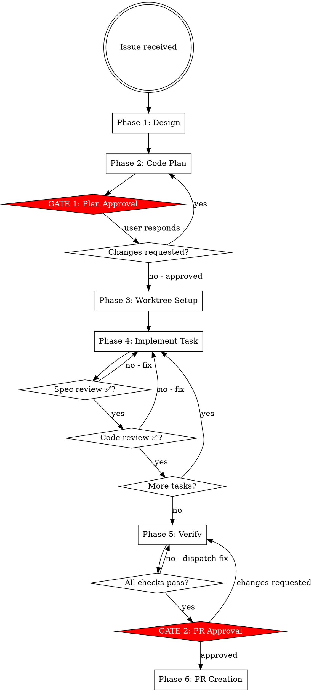

# etcd-druid Feature Development

Full workflow from issue to merged PR. Two hard gates: plan approval before code, PR approval before push.

## ⛔ Iron Law

**NO CODE BEFORE GATE 1. NO PUSH BEFORE GATE 2.**

| Rationalization | Why it fails |
|---|---|
| "The task is tiny, a plan is overkill" | Small tasks skip assumptions that compound fastest |
| "I already know what to write" | Gate 1 is for the human to catch wrong assumptions before code exists |
| "The plan is in my head, that's enough" | Plans not written are not reviewable and lost after compaction |
| "Just a quick prototype to show direction" | Prototypes become the implementation. Gate 1 exists for this. |

## Workflow Overview



---

## Phase 1: Design

1. Create tasks for all workflow phases with TaskCreate
2. Explore upstream (read-only) to understand current state:
   - Which controller, component, or API is affected?
   - Change type: API (`api/core/v1alpha1/`) | component (`internal/component/`) | controller (`internal/controller/`) | test only
   - Test scope required: unit (`make test-unit`) | integration (`make test-integration`) | both
   - **Look at previously merged PRs** for similar change types (`gh pr list --state merged --repo gardener/etcd-druid`). Find 1–2 comparable PRs and read their diffs to understand how the team structures commits, names things, and what reviewers flag. This shapes your plan before the human sees it.
3. Ask clarifying questions one at a time — domain-focused
4. Propose 2–3 approaches with trade-offs
5. Confirm approach before writing plan

**Change type guide:**

| Change | Key files | Generation needed |
|--------|-----------|-------------------|
| New API field | `api/core/v1alpha1/*.go` | Yes — `cd api && make generate` |
| New component | `internal/component/<name>/` | No |
| Controller logic | `internal/controller/<name>/` | No |
| Test only | `internal/component/<name>/*_test.go` or `test/it/` | No |

**API change note:** For any API change, invoke `/etcd-druid:api-change` — it covers field design, field-scoped vs cross-field CEL validation, two-commit generate workflow, CRD test requirements, and `/kind api-change` PR label. Cross-field CEL rules (those referencing `self.metadata` or fields across two sub-structs) must go on the root `Etcd` type, not on the sub-struct.

---

## Phase 2: Code Plan

Write plan to fork (worktree does not exist yet):

```bash
mkdir -p <fork-root>/docs/plans
```

Path: `<fork-root>/docs/plans/YYYY-MM-DD-issue-{id}-{short-description}.md`

**Plan format:**

```markdown
## Issue
Link: https://github.com/gardener/etcd-druid/issues/{id}
Summary: one sentence.

## Change Type
[ ] API change (api/core/v1alpha1/)
[ ] New component (internal/component/)
[ ] Controller change (internal/controller/)
[ ] Test only

## Design Summary
Chosen approach and why. Alternatives considered.

## Tasks
- [ ] Task 1: <name>
      Acceptance criteria: <what done looks like>
      Files: <list>
      Tests: unit | integration | both
      API generation: yes | no

- [ ] Task 2: ...

## PR Checklist (pre-submission)
- [ ] make ci-checks passes
- [ ] make test-unit passes
- [ ] make test-integration passes (if integration touched)
- [ ] E2e verification: <test name or "not required — test-only change">
- [ ] Documentation updated in docs/ (if user-facing change)
- [ ] examples/ updated (if API changed)

## Rollback
How to revert if needed.
```

---

## ⛔ GATE 1: Plan Approval

STOP. No code. No worktree.

Present:
- Task list with acceptance criteria and files
- Which tasks need `cd api && make generate`
- Testing scope per task
- Plan file path

Say: **"Code plan written to `docs/plans/<filename>`. Reply 'approved' to proceed, or tell me what to change."**

Wait for explicit approval. Changes requested → update plan → present again.

---

## Phase 3: Worktree Setup

After Gate 1 approval:

```bash
cd <fork-root>
git fetch upstream
git worktree add ../etcd-druid-ai-TASK-{id} \
  -b ai/TASK-{id}/claude/{short-description} upstream/master
```

Worktree path: `<fork-root>/../etcd-druid-ai-TASK-{id}`
Branch: `ai/TASK-{id}/claude/{short-description}`

Pass worktree path to all subagents.

---

## Phase 4: Per-Task Implementation

**Model selection:**

| Task type | Model |
|-----------|-------|
| Test-only change, single file | haiku |
| New component method, 2–3 files | sonnet |
| API change, new component, multi-file, debugging | opus |

Repeat for each task:

**a.** Mark task `in_progress` (TaskUpdate)

**b.** Dispatch implementer subagent — see `./implementer-prompt.md`.
   Pass: full task text, worktree path, issue number, files affected, whether API generation is needed.

**c.** Show implementer report to user.

**d.** Dispatch spec-reviewer — see `./spec-reviewer-prompt.md`.
   Pass: acceptance criteria, base SHA, head SHA, worktree path.

**e.** Spec issues → implementer fixes → spec-reviewer re-reviews → repeat until ✅

**f.** Dispatch code-reviewer — see `./code-reviewer-prompt.md`.
   Pass: implementer report, base SHA, head SHA, worktree path.
   Only after spec-reviewer ✅.

**g.** Quality issues → implementer fixes → code-reviewer re-reviews → repeat until ✅

**h.** Mark task `completed` (TaskUpdate). Check off plan checkbox.

**i.** Next task.

---

## Phase 5: Verify

Run in worktree:

```bash
cd <worktree-path>
make ci-checks          # format + lint (runs on main module)
make test-unit          # unit tests (Go native + Ginkgo suites)
make test-integration   # integration tests with envtest (if integration work done)
```

For API changes, also verify generation is clean:
```bash
cd <worktree-path>/api
make check-generate     # confirms make generate produces no uncommitted diff
```

All must pass. Any failure → dispatch fix subagent with full failure output.
Do not proceed to Gate 2 until clean.

**E2e verification — decide based on change type:**

| Change type | E2e needed? | Action |
|---|---|---|
| Test-only, no behaviour change | No | Skip |
| Controller logic, component method | Yes | Find matching e2e test, run it targeted |
| New API field, new feature | Yes | Find or write e2e test, run `make ci-e2e-kind` |
| Bug fix with reproduction steps | Yes | Run the specific e2e scenario that reproduces the bug |
| etcd-backup-restore or etcd-wrapper change | Yes | Build custom image, override in druid, run e2e — see `/etcd-druid:e2e` Scenario B or C |

**How to find the right e2e test:**
```bash
# List e2e test functions in etcd-druid
grep -r "func Test" test/e2e/ --include="*.go"

# Find tests related to your change (e.g. configmap, statefulset, backup)
grep -r "TestEtcd\|func Test" test/e2e/ --include="*.go" | grep -i <your-component>

# Run only the relevant test
make PROVIDERS="none,local" \
     GO_TEST_ARGS="-run TestEtcdReconcilerWithNoBackup -v" \
     test-e2e
```

**If no e2e test covers the feature:** note it in the PR's "Special notes for reviewer" section. Opening a follow-up issue for e2e coverage is acceptable; blocking the PR for it is not required unless the change is high-risk.

**Handoff:** Before presenting Gate 2, invoke `/etcd-druid:review` for a final whole-diff review.
This is distinct from the per-task code-reviewer subagent — it reviews the complete change as a human reviewer would see it.
`review` runs as an isolated read-only subagent (`context: fork`) — results are summarized back to this session.
Gate 2 only after review returns LGTM.

---

## ⛔ GATE 2: PR Approval

STOP. No push. No `gh pr create`.

Present:
- PR title (imperative, sentence case, no trailing period)
- PR body draft (see format below)
- `git diff --stat upstream/master...HEAD`
- Full commit list

**PR body:** Read `.github/pull_request_template.md` in the repo and fill it in exactly — Prow bots read the `/area` and `/kind` lines. Do not invent the section names or format from memory.

Before drafting the body, run:
```bash
gh pr list --state merged --repo gardener/etcd-druid --limit 5
```
Find 1–2 merged PRs of the same kind (api-change, bug, enhancement) and read their bodies with `gh pr view <number>`. Mirror the tone, `/area` choice, release note category, and level of detail that the team uses — not a generic template.

**Before pushing:** rebase against `upstream/master` and squash to a minimal number of commits (`git rebase upstream/master`).

Say: **"Ready to create PR. Choose one:
  A) Create PR — I push and open it now
  B) Push branch only — I push; you write the PR description
  C) Make changes — tell me what to fix
  D) Discard — I will confirm before deleting"**

Handle:
- **A** → Phase 6
- **B** → `git push origin <branch>`; print compare URL; stop
- **C** → fix → re-verify → Gate 2 again
- **D** → confirm "Are you sure? This deletes the worktree and branch." → on second confirmation: `git worktree remove` + `git branch -d`

---

## Phase 6: PR Creation

```bash
cd <worktree-path>
git push origin ai/TASK-{id}/claude/{short-description}
gh pr create \
  --base master \
  --title "<approved title>" \
  --body "<approved body>"
```

Show the PR URL.

---

## Subagent Status Handling

| Status | Action |
|--------|--------|
| DONE | Proceed to spec review |
| DONE_WITH_CONCERNS | Read concerns. Correctness/scope issue → fix first. Observation only → note and proceed |
| NEEDS_CONTEXT | Provide missing context and re-dispatch implementer |
| BLOCKED | More context → re-dispatch with stronger model → break task smaller → escalate to human |
