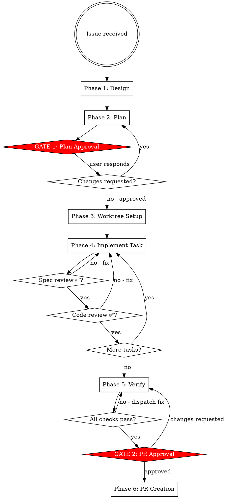

# etcd-druid Feature Development

Full workflow from design to PR. Standalone — no external plugin dependencies.

## When to Use

Use when starting any feature, bug fix, or enhancement across the three-component
system (etcd-druid, etcd-backup-restore, etcd-wrapper).

## Workflow Overview



## Hard Rules

- NEVER write code in the fork or worktree before Gate 1 (plan approval)
- NEVER git push or create a PR before Gate 2 (PR approval)
- NEVER skip spec-review or code-review after each implementation task
- NEVER commit to upstream (/Users/I568019/go/src/github.com/gardener/etcd-druid)
- ALL implementation work happens inside the git worktree

## Workflow

### Phase 1: Design

1. Create tasks for all workflow phases using TaskCreate
2. Explore relevant code in upstream (read-only) to understand current state:
   - Which controller, component, or API is affected?
   - Is this an API change (api/core/v1alpha1/) or internal only?
   - What test scope is needed (unit / integration / both)?
3. Ask clarifying questions one at a time — domain-focused, not generic
4. Propose 2-3 approaches with trade-offs
5. Present design, confirm understanding before writing plan

### Phase 2: Plan

Write plan to fork (not worktree — worktree does not exist yet):
```bash
mkdir -p /Users/I568019/go/src/github.com/seshachalam-yv/etcd-druid/docs/plans
```
Path: `/Users/I568019/go/src/github.com/seshachalam-yv/etcd-druid/docs/plans/YYYY-MM-DD-issue-{id}-{short-description}.md`

Plan format:
```
## Issue
Link and summary.

## Design Summary
Chosen approach and why.

## Tasks
- [ ] Task 1: <name> — <acceptance criteria> — Files: <list>
- [ ] Task 2: <name> — <acceptance criteria> — Files: <list>

## Testing Strategy
Unit / integration scope per task.

## Rollback Notes
How to revert if needed.
```

---

## ⛔ GATE 1: Plan Approval

STOP. Do not write any code. Do not create the worktree.

Present to the user:
- Task list with acceptance criteria
- Files affected per task
- Testing strategy
- Plan file path

Say: "Plan written to docs/plans/<filename>. Reply 'approved' to proceed, or tell me what to change."

Wait for explicit approval. If changes requested: update plan, present again.

---

### Phase 3: Worktree Setup

After Gate 1 approval:

```bash
cd /Users/I568019/go/src/github.com/seshachalam-yv/etcd-druid
git fetch upstream
git worktree add ../etcd-druid-ai-TASK-{id} -b ai/TASK-{id}/claude/{short-description} upstream/master
```

Pass worktree path to all subagents: `/Users/I568019/go/src/github.com/seshachalam-yv/etcd-druid-ai-TASK-{id}`

Branch: `ai/TASK-{id}/claude/{short-description}`

### Phase 4: Per-Task Implementation

**Model selection for implementer subagent:**

| Task type | Model |
|-----------|-------|
| Adding/fixing tests in existing package, single-file change | Fast (haiku) |
| Implementing new component method, 2–3 files | Standard (sonnet) |
| New component across multiple files, API changes, debugging reconciliation failures | Most capable (opus) |

Repeat for each task in the plan:

**a.** Mark task in_progress with TaskUpdate

**b.** Dispatch implementer subagent using `./implementer-prompt.md` template.
   Provide: full task text, worktree path, plan context, files affected, issue number.

**c.** Show implementer report to user.

**d.** Dispatch spec-reviewer subagent using `./spec-reviewer-prompt.md` template.
   Provide: task acceptance criteria, git SHAs of new commits.

**e.** If spec issues found: implementer fixes → spec-reviewer re-reviews → repeat until ✅

**f.** Dispatch code-reviewer subagent using `./code-reviewer-prompt.md` template.
   Provide: git SHAs, etcd-druid conventions checklist.
   Only dispatch AFTER spec-reviewer returns ✅.

**g.** If quality issues found: implementer fixes → code-reviewer re-reviews → repeat until ✅

**h.** Mark task completed with TaskUpdate. Update plan file checkbox.

**i.** Move to next task.

### Phase 5: Verify

Run in worktree:

```bash
cd /Users/I568019/go/src/github.com/seshachalam-yv/etcd-druid-ai-TASK-{id}
make test-unit && make test-integration && make check
```

All must pass. If any fail: dispatch fix subagent with the full failure output.
Do not proceed to Gate 2 until all checks pass.

---

## ⛔ GATE 2: PR Approval

STOP. Do not git push. Do not run gh pr create.

Present to the user:
- PR title (imperative sentence case, no trailing period, e.g. "Add TLS rotation support for etcd StatefulSet")
- PR description draft (problem statement, changes made, testing done)
- `git diff --stat upstream/master...HEAD` output
- Full commit list with messages

Say: "Ready to create PR. Choose one:
  A) **Create PR** — I push the branch and open the PR now
  B) **Push branch only** — I push; you write the PR description yourself
  C) **Make changes** — tell me what to fix first
  D) **Discard** — abandon this branch (I will confirm before deleting)"

Wait for explicit choice. Handle:
- **A**: proceed to Phase 6 as written
- **B**: `git push origin <branch>` only; print the compare URL; stop
- **C**: fix → re-verify → present Gate 2 again
- **D**: confirm "Are you sure? This will delete the worktree and branch." — then `git worktree remove` + `git branch -d` only after second confirmation

---

### Phase 6: PR Creation

After Gate 2 approval:

```bash
cd /Users/I568019/go/src/github.com/seshachalam-yv/etcd-druid-ai-TASK-{id}
git push origin ai/TASK-{id}/claude/{short-description}
gh pr create \
  --base master \
  --title "<approved title>" \
  --body "<approved description>"
```

Show the PR URL to the user.

## Subagent Status Handling

**DONE:** Proceed to spec review.

**DONE_WITH_CONCERNS:** Read concerns. If correctness or scope issue: address before review. If observation only: note and proceed to review.

**NEEDS_CONTEXT:** Provide the missing context and re-dispatch implementer.

**BLOCKED:** Assess — provide more context, re-dispatch with stronger model, break task smaller, or escalate to human.
