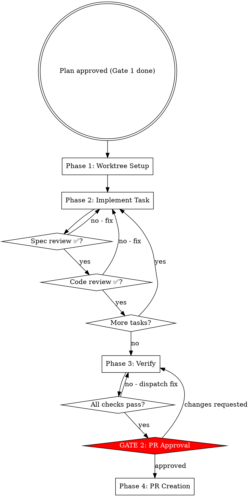

# Implementing etcd-druid Work

Execute an approved plan from worktree setup to merged PR. Entry point: an approved plan file path. Two hard gates: Gate 1 already passed (plan approved), Gate 2 before push.

## ⛔ Iron Law

**NO PUSH BEFORE GATE 2.**

| Rationalization | Why it fails |
|---|---|
| "The CI will catch it" | CI runs after the PR is open — you block reviewers with a broken PR |
| "All local checks pass" | Gate 2 is for the human to review the full diff, not just test results |
| "It's a small change" | Small changes in API types and generated files are highest risk |

## Workflow Overview



---

## Phase 1: Worktree Setup

Read the plan file first. Extract: fork root, issue number, task list.

**API Delta check:** Scan the plan's task list. If any task's Files list includes a path containing `api/core/v1alpha1/` and the plan has no `## API Delta` section, stop and tell the user:
> "This plan touches API types but has no `## API Delta` section. Please add one (one row per field added, modified, or removed) before I proceed."
Do not create the worktree until the API Delta section exists.

Branch name is derived at worktree-creation time: `ai/TASK-{id}/claude/{short-description}` — it is not in the plan file.

```bash
cd <fork-root>
git fetch upstream

# Safety: ensure worktree directory is gitignored before creating it
git check-ignore -q .worktrees || {
  echo '.worktrees/' >> .gitignore
  git add .gitignore
  git commit -m "Add .worktrees/ to .gitignore"
}

git worktree add .worktrees/etcd-druid-ai-TASK-{id} \
  -b ai/TASK-{id}/claude/{short-description} upstream/master
```

Worktree path: `<fork-root>/.worktrees/etcd-druid-ai-TASK-{id}`
Branch: `ai/TASK-{id}/claude/{short-description}`

After creating the worktree, run setup and verify a clean baseline:

```bash
cd <worktree-path>
go mod download

# Verify baseline is clean — new failures mean pre-existing problems, not yours
make test-unit
```

If baseline tests fail: report to user and ask whether to proceed or investigate first.
Do not start implementation on a broken baseline.

Pass worktree path to all subagents.

---

## Phase 2: Per-Task Implementation

**Model selection:**

| Task type | Model |
|-----------|-------|
| Test-only change, single file | haiku |
| New component method, 2–3 files | sonnet |
| API change, new component, multi-file, debugging | opus |

Repeat for each task:

**a.** Mark task `in_progress` (TaskUpdate)

**b.** Dispatch implementer subagent — see `./implementer-prompt.md`.
   Pass: full task text, worktree path, issue number, files affected, whether API generation is needed.
   The implementer prompt instructs subagents to follow `skills/tdd/SKILL.md` — no separate instruction needed.

**c.** Show implementer report to user.

**d.** Dispatch spec-reviewer — see `./spec-reviewer-prompt.md`.
   Pass: acceptance criteria, implementer report, base SHA, head SHA, worktree path.

**e.** Spec issues → implementer fixes → spec-reviewer re-reviews → repeat until ✅

**f.** Dispatch code-reviewer — see `./code-reviewer-prompt.md`.
   Pass: implementer report, base SHA, head SHA, worktree path.
   Only after spec-reviewer ✅.

**g.** Quality issues → implementer fixes → code-reviewer re-reviews → repeat until ✅

**h.** Mark task `completed` (TaskUpdate) AND edit the plan file to flip this task's
   checkbox from `- [ ]` to `- [x]`:

   ```bash
   # In the plan file at <fork-root>/docs/plans/<plan-file>.md
   # Find the line: - [ ] Task N: <name>
   # Change it to:  - [x] Task N: <name>
   ```

   Both must happen together. TaskUpdate tracks state for the current session;
   the plan file checkbox is the durable cross-session record.
   Do not mark a task complete in TaskUpdate without also flipping the checkbox.

**i.** Next task.

---

## Phase 3: Verify

Run in worktree:

```bash
cd <worktree-path>
make ci-checks          # format + lint (runs on main module)
make test-unit          # unit tests (Go native + Ginkgo suites)
make test-integration   # integration tests with envtest (if integration work done)
```

For API changes, also verify generation is clean:
```bash
cd <worktree-path>/api
make check-generate     # confirms make generate produces no uncommitted diff
```

All must pass. Any failure → dispatch fix subagent with full failure output.
Do not proceed to Gate 2 until clean.

**CI pipeline check (required before Gate 2):**

Run the full CI suite per repo — not just local tests:

| Repo | CI command |
|------|-----------|
| etcd-druid | `make ci-checks && make test-unit` (+ `make test-integration` if touched) |
| etcd-backup-restore | `make verify` |
| etcd-wrapper | `make check && make test` |

If any CI job fails, dispatch a fix subagent with the full failure output. Gate 2 is never presented with failing CI.

**Verification discipline:** Apply the verification gate (`skills/verification/SKILL.md`). Do not claim "all checks pass" based on a previous run or inference.

**E2e verification — decide based on change type:**

| Change type | E2e needed? | Action |
|---|---|---|
| Test-only, no behaviour change | No | Skip |
| Controller logic, component method | Yes | Find matching e2e test, run it targeted |
| New API field, new feature | Yes | Find or write e2e test, run `make ci-e2e-kind` |
| Bug fix with reproduction steps | Yes | Run the specific e2e scenario that reproduces the bug |
| etcd-backup-restore or etcd-wrapper change | Yes | Build custom image, override in druid, run e2e — see `/etcd-druid:e2e` Scenario B or C |

**How to find the right e2e test:**
```bash
# List e2e test functions in etcd-druid
grep -r "func Test" test/e2e/ --include="*.go"

# Find tests related to your change (e.g. configmap, statefulset, backup)
grep -r "TestEtcd\|func Test" test/e2e/ --include="*.go" | grep -i <your-component>

# Run only the relevant test
make PROVIDERS="none,local" \
     GO_TEST_ARGS="-run TestEtcdReconcilerWithNoBackup -v" \
     test-e2e
```

**If no e2e test covers the feature:** note it in the PR's "Special notes for reviewer" section. Opening a follow-up issue for e2e coverage is acceptable; blocking the PR for it is not required unless the change is high-risk.

**Handoff:** Before presenting Gate 2, invoke `/etcd-druid:review` for a final whole-diff review.
This is distinct from the per-task code-reviewer subagent — it reviews the complete change as a human reviewer would see it.
`review` runs as an isolated read-only subagent (`context: fork`) — results are summarized back to this session.
Gate 2 only after review returns LGTM.

---

## Red Flags — Stop and Re-read the Iron Law

| Thought | Why it fails |
|---|---|
| "All local checks pass — Gate 2 is a formality" | Gate 2 is for the human to review intent and diff, not just test results |
| "The per-task code-reviewer already approved — skip the final review" | The code-reviewer sees one task. The final review sees the complete change as a reviewer would |
| "CI will catch any issues after the PR is open" | CI runs after the PR is open — you block reviewers with a broken PR |
| "I only changed one small file" | Small API type changes and generated files are highest risk |

---

## ⛔ GATE 2: PR Approval

STOP. No push. No `gh pr create`.

**Who approves:** The human — by choosing A, B, C, or D. Do not self-select an option.

Present:
- PR title (imperative, sentence case, no trailing period)
- PR body draft (see format below)
- `git diff --stat upstream/master...HEAD`
- Full commit list

**PR body:** Read `.github/pull_request_template.md` in the repo and fill it in exactly — Prow bots read the `/area` and `/kind` lines. Do not invent the section names or format from memory.

Before drafting the body, run:
```bash
gh pr list --state merged --repo gardener/etcd-druid --limit 5
```
Find 1–2 merged PRs of the same kind (api-change, bug, enhancement) and read their bodies with `gh pr view <number>`. Mirror the tone, `/area` choice, release note category, and level of detail that the team uses — not a generic template.

**Before pushing:** rebase against `upstream/master` and squash to a minimal number of commits (`git rebase upstream/master`).

Say: **"Ready to create PR. Choose one:
  A) Create PR — I push and open it now
  B) Push branch only — I push; you write the PR description
  C) Make changes — tell me what to fix
  D) Discard — I will confirm before deleting"**

Handle:
- **A** → Phase 4
- **B** → `git push origin <branch>`; print compare URL; stop
- **C** → fix → re-verify → Gate 2 again
- **D** → confirm "Are you sure? This deletes the worktree and branch." → on second confirmation: `git worktree remove` + `git branch -d`

---

## Phase 4: PR Creation

```bash
cd <worktree-path>
git push origin ai/TASK-{id}/claude/{short-description}
gh pr create \
  --base master \
  --title "<approved title>" \
  --body "<approved body>"
```

Show the PR URL.
For handling incoming review feedback after the PR is open, follow `skills/receiving-review/SKILL.md`.

---

## Subagent Status Handling

| Status | Action |
|--------|--------|
| DONE | Proceed to spec review |
| DONE_WITH_CONCERNS | Read concerns. Correctness/scope issue → fix first. Observation only → note and proceed |
| NEEDS_CONTEXT | Provide missing context and re-dispatch implementer. NEEDS_CONTEXT = information only the human has |
| BLOCKED | More context → re-dispatch with stronger model → break task smaller → escalate to human. BLOCKED = task appears impossible as specified |

**Never dispatch multiple implementer subagents in parallel.** Concurrent writes to the same worktree cause conflicts and corrupt the branch history. Always wait for one to complete (or report BLOCKED/NEEDS_CONTEXT) before dispatching the next.

### When parallel agents ARE appropriate

The ban on parallel implementers applies only to tasks writing to the same worktree.
Parallel agents are appropriate when tasks have no shared write state:

| Scenario | Safe to parallelize? |
|----------|---------------------|
| Two implementers on the same worktree | NO — git conflicts |
| Implementer + spec-reviewer | YES — reviewer is read-only |
| Implementer + code-reviewer | YES — reviewer is read-only |
| Fix lint in unrelated packages across separate worktrees | YES — separate branches |
| Run tests in etcd-druid + etcd-backup-restore simultaneously | YES — separate repos |
| Two read-only exploration agents | YES — no writes |

**Rule:** if both agents could write to the same file path at the same time, serialize. Otherwise, parallelize freely.

**Enforcement:** You MUST dispatch spec-reviewer and code-reviewer in a single message containing two Agent tool calls — not in separate messages. Dispatching them sequentially when they are both read-only violates this rule. If you dispatched them in separate messages, you serialized unnecessarily.

---

## Multi-Repo Changes

Some changes span multiple repos (e.g., a new API field in etcd-druid + a new flag in etcd-backup-restore + a config change in etcd-wrapper). The etcd version upgrade flow (`UpgradeEtcdVersion`) is a canonical example.

### When to suspect a multi-repo change

- Adding a new field to `EtcdSpec` that affects sidecar behaviour
- Changing backup/restore semantics (snapshot format, compression, storage)
- Changing etcd configuration that flows through the wrapper
- Any change related to `UpgradeEtcdVersion`, `--next-cluster-version-compatible`, or `--store-endpoint-override`

### Multi-repo workflow

1. **Identify the dependency chain.** etcd-druid depends on etcd-backup-restore and etcd-wrapper via image vector (`internal/images/images.yaml`). Changes flow:
   ```
   etcd-backup-restore (or etcd-wrapper) → image released → etcd-druid image vector updated
   ```

2. **Plan per-repo.** The code plan (in `/etcd-druid:plan` Phase 2) must list tasks per repo with explicit cross-repo dependencies.

3. **Separate PRs per repo.** Each repo gets its own PR. Never combine cross-repo changes into a single PR.

4. **Test each repo independently first:**
   ```bash
   # In etcd-backup-restore fork:
   make verify && make ci-e2e-kind

   # In etcd-wrapper fork:
   make test && make check

   # In etcd-druid fork:
   make ci-checks && make test-unit && make test-integration
   ```

5. **Integration test with custom images.** After individual tests pass, test the full stack together using `/etcd-druid:e2e` Scenario B (custom backup-restore) or C (custom wrapper) with `IMAGEVECTOR_OVERWRITE`.

6. **PR ordering.** Open the sidecar PR first (etcd-backup-restore or etcd-wrapper). Once merged and released, update the image vector in etcd-druid and open that PR.

7. **Vendoring.** etcd-backup-restore and etcd-wrapper use `go mod vendor`. After any dependency change: `make revendor`. etcd-druid does NOT vendor — use `make tidy`.
