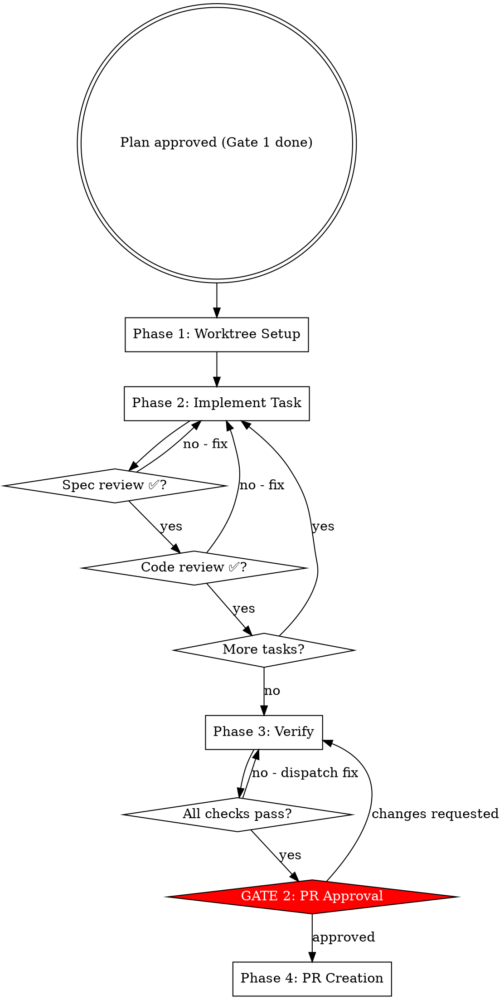

# Implementing etcd-druid Work

Execute an approved plan from worktree setup to merged PR. Entry point: an approved plan file path. Two hard gates: Gate 1 already passed (plan approved), Gate 2 before push.

## Iron Law

**NO PUSH BEFORE GATE 2.**

| Rationalization | Why it fails |
|---|---|
| "The CI will catch it" | CI runs after the PR is open — you block reviewers with a broken PR |
| "All local checks pass" | Gate 2 is for the human to review the full diff, not just test results |
| "It's a small change" | Small changes in API types and generated files are highest risk |

## Workflow Overview



---

## Context Management

Large plans and long implementation sessions fill the context window, causing lost requirements and wrong approaches. Use these patterns to stay within limits.

**Plan-on-disk pattern (default):** The plan file lives on disk (`docs/plans/`), not in conversation context. The orchestrator reads only the current task from the plan file before dispatching each subagent — never load the full plan into context.

**Subagent isolation:** Each implementer subagent gets a clean context window. It reads ~6,000 tokens of task-relevant files but returns a ~400-token summary — 93% context savings for the orchestrator. Always prefer dispatching a fresh subagent over accumulating context in the orchestrator.

**Proactive compaction:** After each task completes and before dispatching the next subagent, evaluate whether the orchestrator context is growing heavy. If it is, compact with focus instructions:
```
/compact Focus on current task requirements and recent test results
```

**The two-corrections rule:** If a subagent has been corrected twice on the same issue, do not retry in the same context. Dispatch a fresh subagent with a better prompt that incorporates what was learned from the failures.

**Commit often:** Commit after each completed task. This creates restore points and keeps the working state clean for the next subagent.

---

## Phase 1: Worktree Setup

Read the plan file first. Extract: fork root, issue number, task list.

**API Delta check:** Scan the plan's task list. If any task's Files list includes a path containing `api/core/v1alpha1/` and the plan has no `## API Delta` section, stop and tell the user:
> "This plan touches API types but has no `## API Delta` section. Please add one (one row per field added, modified, or removed) before I proceed."
Do not create the worktree until the API Delta section exists.

Branch name is derived at worktree-creation time: `feat/issue-{id}/{short-description}` (or `fix/issue-{id}/{short-description}` for bugfixes) — it is not in the plan file.

```bash
cd <fork-root>
git fetch upstream

# Safety: ensure worktree directory is gitignored before creating it
git check-ignore -q .worktrees || {
  echo '.worktrees/' >> .gitignore
  git add .gitignore
  git commit -m "Add .worktrees/ to .gitignore"
}

git worktree add .worktrees/etcd-druid-issue-{id} \
  -b feat/issue-{id}/{short-description} upstream/master
```

Worktree path: `<fork-root>/.worktrees/etcd-druid-issue-{id}`
Branch: `feat/issue-{id}/{short-description}` (or `fix/issue-{id}/{short-description}` for bugfixes)

After creating the worktree, run setup and verify a clean baseline:

```bash
cd <worktree-path>
go mod download

# Verify baseline is clean — new failures mean pre-existing problems, not yours
make test-unit
```

If baseline tests fail: report to user and ask whether to proceed or investigate first.
Do not start implementation on a broken baseline.

Pass worktree path to all subagents.

---

## Parallel Wave Execution

For new sidecar or binary work where the plan groups tasks into independent dependency waves:

1. Identify tasks within each wave that write to non-overlapping directories
2. Launch those tasks as parallel agents (safe when no shared write paths)
3. After all agents in a wave complete, run `go test -count=1 -race ./internal/... ./cmd/...` to verify the wave
4. Only proceed to the next wave after verification passes
5. Fix any failures immediately before continuing

Observed ~60% reduction in one 17-package sidecar build (5h → 2h). Not a universal speedup — only effective when tasks are genuinely non-overlapping and the plan is structured into explicit waves.

The sequential subagent loop (Phase 2 below) remains the default for incremental work where tasks are small and dependencies are tight.

---

## Phase 2: Per-Task Implementation

**Model selection:**

| Task type | Model |
|-----------|-------|
| Test-only change, single file | sonnet |
| New component method, 2-3 files | sonnet |
| API change, new component, multi-file, debugging | opus |

Repeat for each task:

**Before dispatching any subagent — build the readiness matrix:**

1. **Backfill from plan file (handles resume):**
   Read the plan file. For every task showing `- [x]` in the plan file that is not
   yet `completed` in TaskList, call `TaskUpdate` to mark it completed now.
   This makes TaskList accurate for the current session regardless of whether this
   is a fresh start or a resumed session.

2. **Evaluate readiness:**
   For each task, classify:
   - completed — plan file shows `[x]` for this task
   - ready — all `depends-on` tasks are completed, or `depends-on: —`
   - blocked — at least one `depends-on` task is not yet completed

3. **Render the matrix:**

   ```
   Task Readiness — YYYY-MM-DD — docs/plans/<plan-file>.md

     ✅  Task 1 — <name>    [completed]
     🔓  Task 2 — <name>    [ready]
     🔒  Task 3 — <name>    [blocked — waiting on Task 2]

   Starting with Task 2.
   ```

4. **All-complete guard:** If all tasks show completed, display the matrix and skip the
   per-task loop entirely — proceed directly to Phase 3 Verify.
   Message: "All tasks already complete. Proceeding to Phase 3 verification."

5. **Start** with the first ready task. If no task is ready (all blocked),
   stop and report to the user: which tasks are blocked and what they are waiting for.

**a.** Mark task `in_progress` (TaskUpdate)

**b.** Dispatch implementer subagent — see [IMPLEMENTER-PROMPT.md](./IMPLEMENTER-PROMPT.md).
   Pass: full task text, worktree path, issue number, files affected, whether API generation is needed.
   The implementer prompt instructs subagents to follow `skills/tdd/SKILL.md` — no separate instruction needed.

**c.** Show implementer report to user.

**d.** Dispatch spec-reviewer — see [SPEC-REVIEWER-PROMPT.md](./SPEC-REVIEWER-PROMPT.md).
   Pass: acceptance criteria, implementer report, base SHA, head SHA, worktree path.

**e.** Spec issues → implementer fixes → spec-reviewer re-reviews → repeat until pass

**f.** Dispatch code-reviewer — see [CODE-REVIEWER-PROMPT.md](./CODE-REVIEWER-PROMPT.md).
   Pass: implementer report, base SHA, head SHA, worktree path.
   Only after spec-reviewer passes.

**g.** Quality issues → implementer fixes → code-reviewer re-reviews → repeat until pass

**h.** Mark task `completed` (TaskUpdate) AND edit the plan file to flip this task's
   checkbox from `- [ ]` to `- [x]`:

   ```bash
   # In the plan file at <fork-root>/docs/plans/<plan-file>.md
   # Find the line: - [ ] Task N: <name>
   # Change it to:  - [x] Task N: <name>
   ```

   Both must happen together. TaskUpdate tracks state for the current session;
   the plan file checkbox is the durable cross-session record.
   Do not mark a task complete in TaskUpdate without also flipping the checkbox.

**i.** Next task.

---

## Phases 3-4: Verification, Gate 2, and PR Creation

For Phase 3 verification and Gate 2, see [PHASE-3-VERIFICATION.md](PHASE-3-VERIFICATION.md).

For PR creation, multi-repo changes, and cherry-picks, see [PHASE-4-PR.md](PHASE-4-PR.md).
