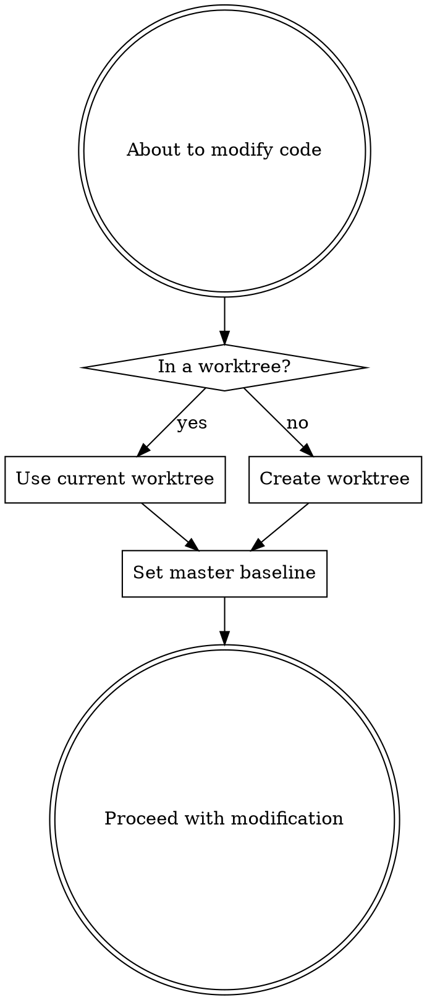

# Worktree Gate

## ⛔ Iron Law

**NO CODE MODIFICATION OUTSIDE A WORKTREE.**

| Rationalization | Why it fails |
|---|---|
| "I'll just fix this one thing in-place" | One fix becomes three. Now your fork root has uncommitted debris mixed with the fix |
| "I'm already on the right branch" | A branch is not isolation. A worktree gives you a clean directory with `upstream/master` as diff baseline |
| "Creating a worktree is overkill for this" | Worktree creation takes 5 seconds. Untangling mixed changes takes 30 minutes |
| "I'll create a branch instead" | A branch shares the working tree. Other uncommitted changes bleed into your diff |
| "The TDD/debug skill doesn't mention worktrees" | It references this gate. You're reading it now. Create the worktree |

---

## The Gate

BEFORE modifying any code file (Edit, Write, or Bash commands that write to source files), execute this gate:

### Step 1: Detect current location

```bash
# Am I inside a worktree?
WORKTREE_ROOT=$(git rev-parse --show-toplevel 2>/dev/null)
COMMON_DIR=$(git rev-parse --git-common-dir 2>/dev/null)
GIT_DIR=$(git rev-parse --git-dir 2>/dev/null)

# If GIT_DIR != COMMON_DIR, we are in a worktree (not the main working tree)
if [ "$GIT_DIR" != "$COMMON_DIR" ]; then
  echo "IN_WORKTREE=true"
  echo "WORKTREE_PATH=$WORKTREE_ROOT"
else
  echo "IN_WORKTREE=false"
fi
```

### Step 2: Act on the result



**If already in a worktree:** Use it. Note the worktree path and continue.

**If NOT in a worktree:** Create one before touching any code:

```bash
FORK_ROOT=$(git rev-parse --show-toplevel)
cd "$FORK_ROOT"
git fetch upstream

# Determine branch prefix from context
# debug → debug/, tdd → feat/ or fix/, receiving-review → use existing branch
BRANCH_NAME="<type>/issue-<id>/<short-description>"

# Safety: ensure .worktrees/ is gitignored
git check-ignore -q .worktrees 2>/dev/null || {
  echo '.worktrees/' >> .gitignore
  git add .gitignore
  git commit -s -m "chore: add .worktrees/ to .gitignore"
}

# Create the worktree
git worktree add ".worktrees/<worktree-name>" -b "$BRANCH_NAME" upstream/master

cd ".worktrees/<worktree-name>"
go mod download
```

### Step 3: Set master as reference baseline

Once in the worktree, confirm the baseline:

```bash
# Verify upstream/master is reachable
git log --oneline upstream/master -1

# At any point during work, compare against master:
git diff upstream/master...HEAD              # what you changed
git show upstream/master:path/to/file        # read the original version
git diff upstream/master -- path/to/file     # diff a specific file
```

This is the key value: **you always know what you changed vs. what master looks like.**

---

## Context Passing

When a worktree is active, pass these two values to every subagent and every skill invocation:

| Variable | Value | Purpose |
|----------|-------|---------|
| `WORKTREE_PATH` | Absolute path to worktree root | All file operations happen here |
| `BASELINE_REF` | `upstream/master` | Diff baseline for comparing changes |

Skills that receive these values must operate within `WORKTREE_PATH`, not the fork root.

---

## Branch Naming

Derive branch name from the invoking context:

| Invoked from | Branch pattern | Example |
|---|---|---|
| `implement` (plan exists) | `feat/issue-{id}/{desc}` or `fix/issue-{id}/{desc}` | `feat/issue-1350/add-configmap-ttl` |
| `debug` (standalone) | `debug/{desc}` | `debug/fix-statefulset-nil-pointer` |
| `tdd` (standalone) | `test/{desc}` | `test/add-configmap-ttl-tests` |
| `receiving-review` | Use existing branch | (already in worktree from implement) |

Never use `ai-`, `claude-`, or similar prefixes. Branches must look human-authored.

---

## Red Flags — Stop and Re-read the Iron Law

| Thought | Why it fails |
|---|---|
| "I'm just reading code, not modifying" | Reading doesn't need a worktree. The gate triggers on modification, not exploration |
| "The worktree already exists but I'm not in it" | `cd` into it. Don't create a second one |
| "I'll create the worktree after this quick fix" | The fix IS the modification. Create the worktree BEFORE |
| "This is a standalone debug session, worktrees are for implement" | Every code modification needs a worktree. No exceptions |
| "I already have uncommitted changes here" | Stash them. Create the worktree. Apply changes there if they're relevant |

---

## Cleanup

After work is complete, the invoking skill decides cleanup:

- **From `implement`** → `finishing-a-development-branch` skill handles it
- **From standalone `debug`/`tdd`** → ask the user: keep the worktree (for a PR) or remove it (`git worktree remove`)
- **Never auto-delete** a worktree with commits

---

## Handoff

This gate does not have its own handoff — control returns to the invoking skill once the worktree is established. The invoking skill is responsible for all subsequent workflow (implementation, testing, review, PR).
